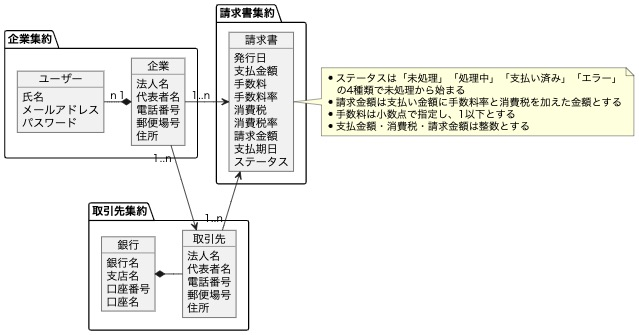

# 請求書API

請求書データの登録および閲覧ができるAPIです。

## 実装内容
4つのエンドポイントを実装しています。
- ユーザ登録 `POST /api/users`
- ログイン `POST /api/users/login`
- 請求書登録 `POST /api/invoices`
- 請求書一覧(期限内の未払いのもの) `GET /api/invoices?date=YYYY-MM-DD`

## アプリケーションアーキテクチャ
オニオンアーキテクチャを採用し、ドメイン層を独立させています。

複数のリポジトリを跨いでデータを取得する際はクエリサービスを利用しています。

### ドメインモデル図
<div align="center">
 
</div>
企業集約・取引先集約・請求書集約と分けております。銀行と取引先は1対1で紐づく想定です。

## セットアップ
### DBの起動
```
make db-up
```
### マイグレーション
```
make db-migrate
```
### シードデータ挿入
企業・取引先・銀行データについては、作成するためのエンドポイントを作っていないので直接DB操作をしてデータを挿入してください。

データ挿入用SQLは /db/seed/seed.sql に入っており、以下のコマンドで最低限のデータを入れられます。
```
db/seed/run_sql.sh
```

### 環境変数の設定
`.env.dev`をコピーして`.env`ファイルを作成してください。JWT認証のための任意のキーを設定してください。

### サーバ起動
```
make up
```

## 動作確認
企業ID、ユーザ名、メールアドレス、パスワードを指定しユーザを作成後、ログインを行なってください
- ユーザ登録
```
curl -X POST 'http://localhost:8080/api/users/' \
--header 'Content-Type: application/json' \
--data-raw '{
    "company_id": 1,
    "name": "test-user",
    "mail": "test@example.com",
    "password": "password"
}'
```
- ログイン
```
curl -X POST 'http://localhost:8080/api/users/login' \
--header 'Content-Type: application/json' \
--data-raw '{
    "mail": "test@example.com",
    "password": "password"
}'
```
ログイン時にJWTが返却されるので、Authorizationヘッダに`Bearer {jwt}`を指定してAPIを叩いてください。

**請求書APIの例:**
- 請求書一覧 
```
curl GET 'http://localhost:8080/api/invoices?date=2024-04-30' \
--header 'Authorization: Bearer {jwt}'
```
- 請求書作成
```
curl -X POST 'http://localhost:8080/api/invoices/' \
--header 'Authorization: Bearer {jwt}' \
--header 'Content-Type: application/json' \
--data-raw '{
    "customer_id": 1,
    "payment": "10000",
    "fee_rate": "0.04",
    "deadline": "2024-04-30"
}'
```


---
<details>
<summary>TODO</summary>

- ユーザと企業を一つのリポジトリにする
- テストの追加
    - 統合テスト
    - 各レイヤーでの単体テスト
- 管理者ロールの追加
    - 企業情報のCRUD
- 顧客・銀行のCRUD
    - 顧客と銀行の取り替え
- エラーハンドリング改善
    - スタックトレースを取れるようにする
    - 500番台エラーの発生箇所を明示
- プレゼンテーション層でのバリデーション追加
- 古いJWTの無効化
- linterの導入
- contextの中身の受け渡し修正
